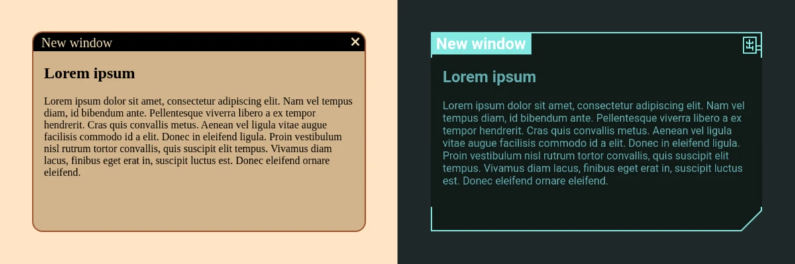

# PWin - Page Windows

Read in different languages: [Русский](./README_RU.md).

PWin allows to create HTML containers, that would be similar in looks and functions to app windows on a common PC.

Examples:
* [Pathos](https://leshiy-nd.github.io/PWin-Page-Windows/examples/pathos.html)
* [Tan](https://leshiy-nd.github.io/PWin-Page-Windows/examples/tan.html)

## Window structure

|CSS Class|Description|
|-|-|
|pwin_root|Parent container for all PWin-windows. Invisible and takes up whole screen, while not interfering interactions with others elements of a website.|
|pwin_win|Container of any particular PWin-window.|
|pwin_hand|By putting mouse cursor over this element and holding left key user would be able to move it's PWin-window whereever they would like it to be.|
|pwin_hand_g|Grabbed __pwin_hand__. Scales up 100 times in size, to minimize chance of it loosing mouse cursor. So I wouldn't recommend to put anything in it.|
|pwin_close|Just a button to close it's PWin-window.|
|pwin_body|Contains the html content of the PWin window.|

## Usage

1. Copy [__pwin.js__](./pwin.js) and [__pwin.css__](./pwin.css) to somewhere in your website directory.
2. Put them in the HEAD of a page you would use it on.
3. Create an empty DIV of class __"pwin_root"__ within BODY of the page.
4. Make a JS script for generation of a PWin-window (or take one from examples).
5. Make CSS styles (or take ones from examples).
6. To breathe life into freshly spawned windows, launch function __register_new_windows()__ from __pwin.js__.
7. Mention me somewhere somehow, if that wouldn't be a problem :)

## Custom PWin-window generation script

Mandatory:
* There already must be at least one __"pwin_root"__, find the one you need.
* Create an empty DIV of class __"pwin_win"__ and append it to __"pwin_root"__.
* Set empty attribute __"pwin_new"__ for __"pwin_win"__.

Optional:
* Create an empty DIV of class __"pwin_hand"__ and append it to __"pwin_win"__.
* Create an empty DIV of class __"pwin_close"__ and append it to __"pwin_win"__.
* Create a DIV of class __"pwin_body"__ and append it to __"pwin_win"__.
* Put any relevant stuff into innerHTML of __"pwin_body"__.

Doesn't matter how deep or peculiar __hand__, __close__ and others were placed. While they're within family tree of a __win__, they will be picked up by __register_new_windows()__.

## Custom PWin-window CSS styling

You're free to do whatever you feel like.

The only thing I would restrain you from is putting _"overflow: hidden;"_ on __"pwin_win"__, as it will cut down __"pwin_hand_g"__. Which would othen lead to it loosing mouse cursor, as it may be seen on [Pathos](https://leshiy-nd.github.io/PWin-Page-Windows/examples/pathos.html) example, where I used hidden overflow to manage the border and "cutted off" angle. Simply add special DIV for whatever may go loose.
